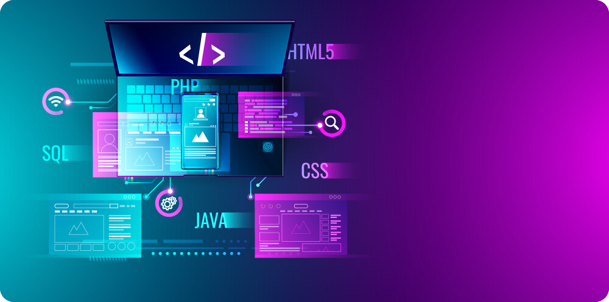

# Hi 👋, I'm Abolfazl 

## A full-stack (high on backend) Laravel developer

## Check out My Smart Site: [abol-web.iran.liara.run](https://abol-web.iran.liara.run/cv)

### About Me
I'm an accomplished web developer specializing in Laravel.

**What I Bring to the Table:**
- Proficient in **PHP, MySQL, HTML, CSS,** and **JavaScript,** I offer a dynamic and diverse skill set.
- Passionate about intelligent coding, I strive to create innovative and impactful solutions.
- With a deep understanding of web development, I consistently deliver exceptional user experiences.

### What I'm Working On
- 🔭 Currently working on **Laravel**
- 🌱 Learning **Full stack technologies**
- 👯 Looking to collaborate on **innovative technologies**
- 🤔 Seeking help with **community projects**
- 💬 Ask me about **Web development**
- ⚡ Fun fact: My diversity in web development makes it a fun journey

### Achievements

    

### Portfolio
- 👨‍💻 All of my projects are available at: [My Portfolio](https://abol-web.iran.liara.run/cv)
- 📄 Learn about my experiences: [My Resume](https://abol-web.iran.liara.run/cv)

### Languages and Tools:

#### Back-end Development
&nbsp;
&nbsp;
&nbsp;
&nbsp;
&nbsp;

#### Front-end Development
&nbsp;
&nbsp;
&nbsp;
&nbsp;
&nbsp;
&nbsp;
&nbsp;
&nbsp;

#### DevOps & Tools
&nbsp;
&nbsp;
&nbsp;
&nbsp;

### GitHub Stats

### Connect with Me

  
<a href="https://linkedin.com/in/abolfazl-rajaee-nasab-195aa3225" target="blank"> Linkedin: Abolfazl Rajaee nasab</a>

<a href="mailto:fazlabol18@gmail.com" target="blank"> Gmail: fazlabol18@gmail.com</a>

<a href="https://t.me/abol_web" target="blank"> Telegram: @abol_web</a>

<a href="https://wa.me/+989045426387" target="blank"> WhatsApp: +989045426387</a>

<a href="https://tiktok.com/@abol.fazl.2004" target="blank"> TikTok: @abol.fazl.2004</a>

